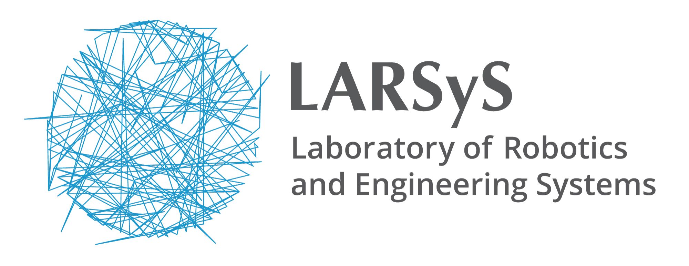
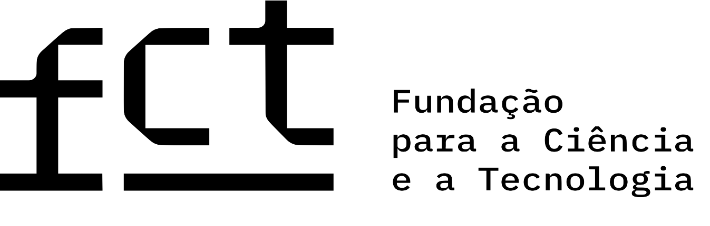

# Pegasus

**Pegasus** is a quasi open-source Guidance, Navigation and Control (GNC) software package for controlling autonomous drones using ROS 2. 
It is designed to be used with the PX4 flight stack, but open enough to be used with other flight stacks as well. It is mainly written in C++ and Python.

<p align = "center">
  <a href="https://youtu.be/_11OCFwf_GE" target="_blank"></a>
</p>

This work is part of the **Pegasus Project**, a semi-personal side project started by [Marcelo Jacinto](https://scholar.google.com/citations?user=tVPo_z0AAAAJ&hl=en) with the end-goal of supporting experimental validation of his Ph.D. It provides:

- A set of ROS 2 nodes with a modular state machine;

- A CAD model for a 3D printed drone used in the project;

- An interface with PX4 and Pegasus Simulator and Gazebo Classic for 3D simulations;

This project is provided as is, with no warranty or support. It is intended to be used as a reference for other researchers and developers in the field of control and robotics. It may **NOT**
be used for commercial purposes or military applications without the explicit consent from the project founder.

## Documentation

The documentation for this project is available at [https://pegasusresearch.github.io/pegasus/](https://pegasusresearch.github.io/pegasus/).

## Citation

While an article for the Pegasus GNC project is not publicly available yet, if you find ``Pegasus GNC`` useful in your academic work, please cite the "second most adequate paper":
```
@INPROCEEDINGS{10556959,
  author={Jacinto, Marcelo and Pinto, João and Patrikar, Jay and Keller, John and Cunha, Rita and Scherer, Sebastian and Pascoal, António},
  booktitle={2024 International Conference on Unmanned Aircraft Systems (ICUAS)}, 
  title={Pegasus Simulator: An Isaac Sim Framework for Multiple Aerial Vehicles Simulation}, 
  year={2024},
  volume={},
  number={},
  pages={917-922},
  keywords={Simulation;Robot sensing systems;Real-time systems;Sensor systems;Sensors;Task analysis},
  doi={10.1109/ICUAS60882.2024.10556959}
}
```

## Main Developer Team

This simulation framework is an open-source effort, started by me, [Marcelo Jacinto](https://scholar.google.com/citations?user=tVPo_z0AAAAJ&hl=en) in January/2023. It is a tool that was created with the original purpose of serving my Ph.D. workplan for the next 4 years, which means that you can expect this repository to be mantained, hopefully at least until 2027.

* Project Founder
	* [Marcelo Jacinto](https://github.com/MarceloJacinto), under the supervision of <u>Prof. Rita Cunha</u> (IST/ISR-Lisbon)
* Architecture
  * [Marcelo Jacinto](https://github.com/MarceloJacinto)
  * [João Pinto](https://github.com/jschpinto)
* CAD Model
  * [Marcelo Jacinto](https://github.com/MarceloJacinto)
* Documentation
  * [Marcelo Jacinto](https://github.com/MarceloJacinto)
  * [João Pinto](https://github.com/jschpinto)
  * [Pedro Trindade](https://scholar.google.com/citations?hl=en&user=eFG-wQ0AAAAJ)

As the author of this work, I would like to thank the support of the following coleagues and friends (in no particular order) during the development and testing of this project.
[Pedro Trindade](https://scholar.google.com/citations?hl=en&user=eFG-wQ0AAAAJ), [João Pinto](https://github.com/jschpinto), [Gil Serrano](https://scholar.google.com/citations?hl=en&user=h_6XghgAAAAJ), [Jose Gomes](https://scholar.google.com/citations?hl=en&user=PECAagsAAAAJ), [Pedro Santos](https://scholar.google.com/citations?hl=en&user=HOhIHJAAAAAJ) and Joao Lehodey. Not only have you made this project possible, but also crashing drones an enjoyable experience! Checkout their work and contributions in the field of control and robotics.

I also want to thank the support of:

* Manuel Rufino for assisting me in the soldering job of the drone, 
* José Tojeiro for being an awesome safety pilot during the first flights and teach me the basics of drone piloting,
* Alexandre Lopes for being willing to help me during the flight tests of the Pegasus prototype,

and all the other friends, colleagues and family that have supported me during the development of this project.

 
## Project Sponsors
The work developed by Marcelo Jacinto and João Pinto was supported by Ph.D. grants funded by Fundação para a Ciência e Tecnologia (FCT).

<p float="left" align="center">
   
   
   
   
</p>
